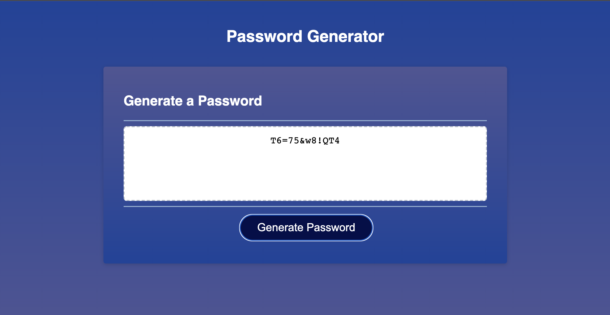

# password-generator

# About
This is a password generator application. It generates ramdom password based on the users preferences. The users can choose a password between 8 and 128 characters. They can include lowercase, uppercase, numbers and symbols in their password. If a user chooses less than 8 or greather than 128 characters for their password, they will get an alert. furthermore, the users must choose at least one of the options for their password. Otherwise they will get an alert too.

# Screenshot of The Deployed Application

# Links

[Link to the Deployed Application](https://hekmatsalehi.github.io/password-generator/)